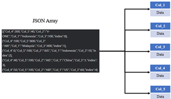
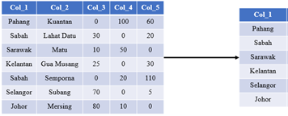
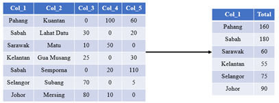
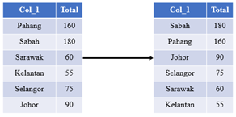
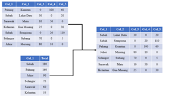
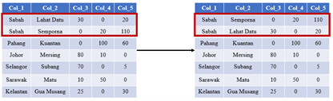
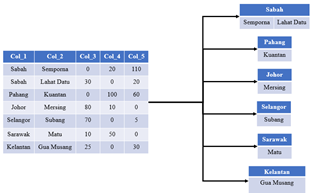
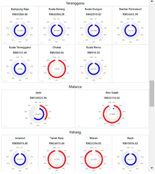

# Plotting-Multiple-AmCharts-Dynamically-using-JavaScript
Plotting multiple charts such as Radio Chart from AmCharts Library may require some coding effort to be plotted. This code aims to eliminate the need to create an independant code for each chart by dynamically plotting out x amount of charts depending on the data that was used to plot the charts in the form of a JSON file.

# First Loop

In the first loop, the data in the form of JSON is filtered and assigned to arrays called Col_1 to Col_5. By sorting out the JSON data into individual arrays, we will be able to manipulate the data easier and perform some data processing using the index of the array which will be seen in the consecutive loops. 

# Second Loop

The second loop is responsible to identify the unique data from col_1. It will use a nested loop to store the unique values in col_1 by constantly checking  if there is any duplicated entry in the array by using a variable called unique_ctr. unique_ctr is a counter which will increase by 1 if there is a duplicated entry in the array. Once the first loop has ended, the code will check if unique_ctr is 0 which is equivalent to no duplicate and if there is no duplicate the current data will be pushed into an array called col_1_unique. The loop will go on until it reaches the end of the index of col_1.

# Third Loop

The third loop is responsible for summing up the unique values of col_1_unique by grouping all the data in Col_2 to Col_5 into an array called total_value_arr. It utilizes a nested loop to check if any of the row matches with the current index of col_1_unique and accumulates the value by grouping it together.

# Fourth Loop

The fourth loop is responsible for ranking the data in descending order. By using a nested loop that checks for the current value with the next consecutive value of total_value_arr data, we can identify which data is more than which and assign a rank to them based on the result. For example, if total_value_arr[0] is 10 and total_value_arr [1] is 20 then total_value_arr[1] will be more than total_value_arr[0] which makes it rank 1. 

# Fifth and Sixth Loop

The fifth loop and sixth loop perform the same action by sorting the array from col_2 to col_5 by following the ranks assigned in the fourth loop. It will check for all the data in col_1_sort and rearrange the structure of the rest of the array by pushing the data into a new array from col_2_sort to col_5_sort by utilizing the index of the loop. 

# Seventh and Eighth Loop

The seventh loop and eighth loop also come in a pair whereby they are responsible to sort the sub classes of col_1, which is col_2 to col_5, in descending order. For example, we can see that the only row which has a duplicated value in col _1 is Sabah, and it has 2 subclasses in col_2 called Semporna and Lahat Datu. The subclasses which is col_2 is sorted in descending order as seen where Semporna which has more collective value from col_3 to col_5 is ranked first and Lahat Datu is ranked second. 

# Ninth Loop

The ninth loop is responsible for creating tables using JavaScript. The concept is that 1 table will be created each time the loop detects a change in col_1 data. If the data is duplicated, for example in Figure 53 where Sabah is repeated twice, then a table data will be inserted depending on how many duplicates is available. In our case, each state has their own table after the execution of the code. 

# Tenth Loop

The tenth loop is basically using a loop to create a chart by using am chart to populate each table data.
